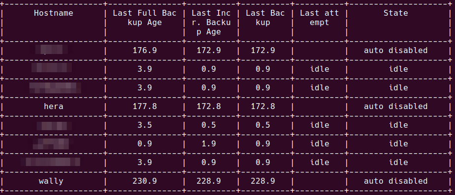
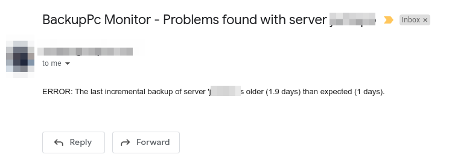
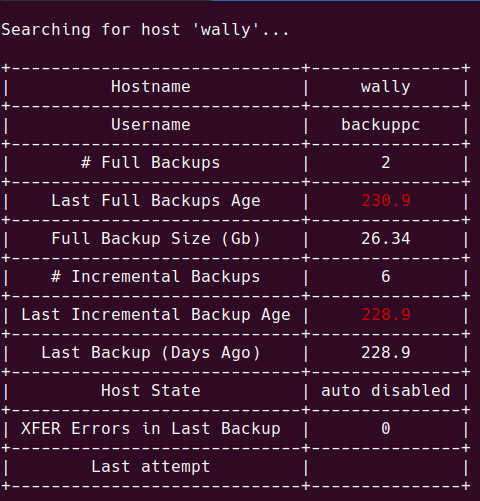

# BackupPc Reports

A simple script to interact with BackupPc interface from the command line.

## Install

Clone the repository:

git clone https://github.com/hernancollazo/backuppc-reports.git /opt/backuppc-reports/

Create a virtual-env and install all required dependencies there

```sh
cd /opt/backuppc-reports/
python3.6 -m venv venv
source /opt/backuppc-reports/venv/bin/activate
pip3 install -r requirements.txt
cp backuppc-reports.cfg.dist /opt/backuppc-reports/backuppc-reports.cfg
vim /opt/backuppc-reports/backuppc-reports.cfg # Change all the information there!
```

## Usage

### Check the help:

```sh
$ source /opt/backuppc-reports/venv/bin/activate
$ python3 backuppc-reports.py --help
```

### Show a summary

```sh
$ source /opt/backuppc-reports/venv/bin/activate
$ python3 backuppc-reports.py -c ./myconfig.cfg summary
```



### Monitor all backups

```
$ python3 backuppc-reports.py -c ./myconfig.cfg monitor
Ignoring host server001 - disabled by user.
Ignoring host server003 - disabled by user.
ERROR: The last incremental backup of server 'server002' is older (2.9 days) than expected (2 days).
```

If there is any host that does not have backups at least in the last X days indicated in the config, you will receive an email like this:



Any alert for servers that are configured as 'disabled' in the backuppc config will be discarded.

### Check backuppc information for a particular host

```
$ python3 backuppc-reports.py -c ./myconfig.cfg hostinfo --server wally
```



## License

This software is available under the following licenses:

- MIT
